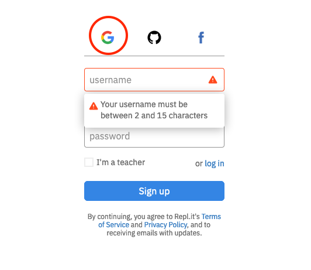
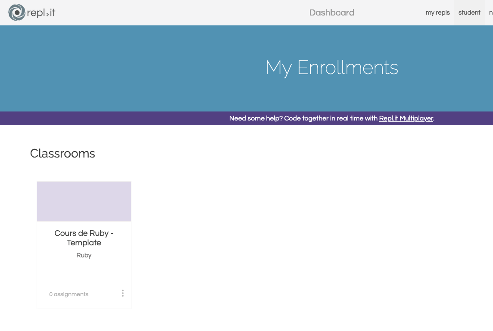

# Session 1 - Création des comptes REPL.IT

## Lien d'invitation

REPL.it dispose d'une fonctionnaltié de "classes virtuelles".

L'enseignant crée une "classe virtuelle" puis obtient un lien que les étudiants peuvent utiliser pour s'inscrire.

Dans le cadre de notre cours, le lien à utiliser est : [https://repl.it/classroom/invite/vda7rl9](https://repl.it/classroom/invite/vda7rl9).

## Procédure de création de votre compte

1) Cliquez sur le lien d'invitation mentionné plus haut.

2) Une interface de connexion apparaît. Puisque les comptes étudiants de Sciences Po sont liés à Google, nous allons utiliser la fonctionnalité de connexion via un compte Google. Pour cela, cliquez sur l'icône G de Google.

3) Connectez-vous ensuite avec votre compte Google de Sciences Po.

4) Vous devez alors obtenir l'écran ci-après :

## Procédure pour vous connecter à REPL.it par la suite

1) Cliquez sur [https://repl.it/student](https://repl.it/student)

2) Cliquez sur l'icône G de Google.

3) Connectez-vous avec votre compte Google de Sciences Po.

4) Vous devez alors obtenir l'écran ci-après :

Maintenant que votre compte est créé et que vous savez vous connecter à REPL.it, nous allons regarder comment faire des exercices via REPL.it.

[Retour à la table des matières](../)