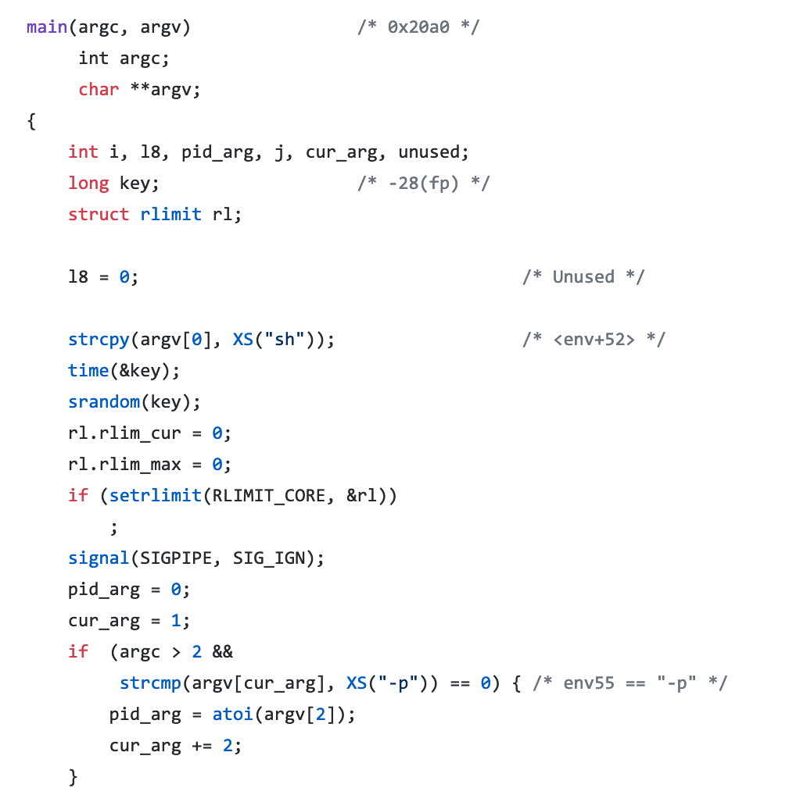
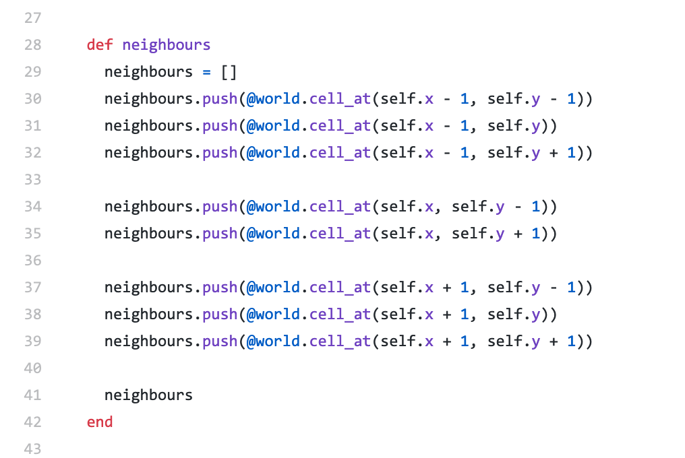
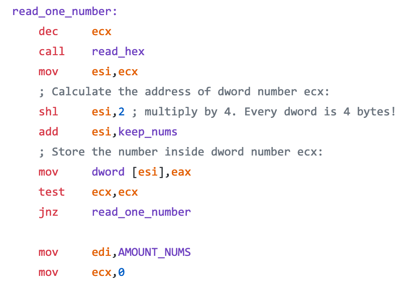
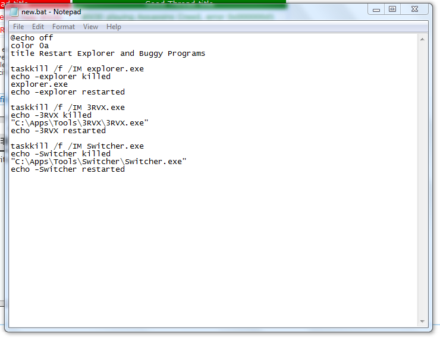

# Session 1 - De l'importance de l'environnement de développement

## Instructions informatiques

Tout programme informatique repose sur un ensemble de fichiers contenant des instructions.

Ces instructions sont rédigées dans un langage qu'un ordinateur peut lire et exécuter, afin de manipuler et créer de l'information.

Vous trouverez ci-dessous deux exemples d'instructions :
- un extrait d'instructions rédigées en C, issues du virus informatique Morris ;
- un extrait d'instructions rédigées en Ruby, tirées du "Jeu de la vie" de Conway.

Ces instructions peuvent être écrites en plusieurs formats :
- si elles sont rédigées dans du texte facile à lire pour un humain, on parle alors de "langage haut-niveau" ;
- si elles sont rédigées dans du texte difficile à lire pour un humain, on parle alors de "langage bas-niveau".

Quelques exemples de langages de type "haut-niveau" sont C, PHP, Ruby, Java, Python. Pour le "bas-niveau", un exemple est l'assembleur.

Un ensemble d'instructions est appelé un "programme". De plus, on utilisera souvent le terme "code informatique" pour parler d'une instruction ou d'un programme.

D'une manière générale, on peut considérer que :
- les instructions faciles à lire pour un humain sont faciles à modifier pour des développeurs mais lentes à exécuter pour une machine ;
- les instructions difficiles à lire pour un humain sont difficiles à modifier pour des développeurs mais rapides à exécuter pour une machine.

Ainsi, lorsque l'on cherche à faire un programme informatique facile à modifier, c'est-à-dire moins coûteux en termes de maintenance pour des développeurs, on utilisera un langage haut-niveau, tandis que si l'objectif premier est de faire un programme très performant et très rapide à exécuter on privilégiera un langage bas-niveau.

## Comment exécuter des instructions informatiques ?

Les instructions d'un programme sont exécutées par une partie très connue d'un ordinateur : le processeur.

Un processeur est un circuit électronique très complexe qui contient une horloge à très haute fréquence. Cette fréquence décrit le nombre d'impulsions électriques envoyées chaque seconde dans le circuit : un processeur cadencé à 3GHz effectue ainsi 3 000 000 000 d'impulsions chaque seconde.

A chaque impulsion électrique, le circuit électronique réalise des opérations basiques (addition / soustraction / multiplication, etc.).

La combinaison de toutes ces opérations est à la base de toute l'informatique moderne, y compris l'affichage de texte ou de couleurs sur un écran (mais nous verrons cela plus tard).

## Comment rédiger des instructions ?

Les instructions d'un programme sont rédigées sur un dispositif que le processeur pourra lire.

Au début de l'informatique, les programmes étaient rédigées à l'aide de cartes perforées comme ci-après :

Ces cartes étaient alors insérées dans une machine, qui lisait les cartes ligne par ligne et exécutait des opérations en fonction des trous effectués sur ces lignes.

Aujourd'hui, la plupart des programmes informatiques sont rédigés sous forme de texte directement sur un ordinateur. Ainsi, un simple fichier texte ouvert sous le bloc-notes (notepad) d'un ordinateur Windows ou même via l'application Notes de macOS peut constituer un programme informatique.

Ainsi, les programmes informatiques sont maintenant rédigés en grande majorité dans un outil de type "éditeur de texte", avec éventuellement quelques fonctionnalités qui aident à programmer plus rapidement.

## Les EDI (Environnement de Développement Intégré)

Nous venons de voir que pour rédiger et exécuter un programme, nous avons besoin :
- d'un éditeur de texte pour écrire / modifier les instructions du programme ;
- d'un processeur pour exécuter les instructions du programme.

Des logiciels ont été mis au point pour faciliter le travail des développeurs, et permettre de facilement visualiser / modifier des fichiers de code, et également facilement déclencher l'exécution du code.

On parle alors d'EDI pour Environnement de Développement Intégré ou IDE pour Integrated Development Environment.

Quelques exemples d'IDE sont : Atom, Visual Studio Code, RubyMine, PyCharm... Ces IDE sont très efficaces et complets, mais nécessitent d'être installés sur l'ordinateur de l'utilisateur.

Dans le cadre de ce cours, afin de faciliter nos travaux, nous utiliserons des outils qui fonctionnent sans installation et 100% dans un navigateur web.

[Retour à la table des matières](../)