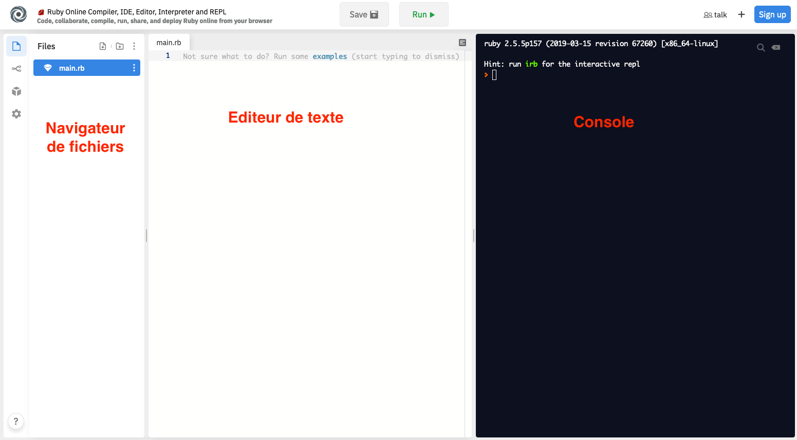
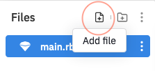
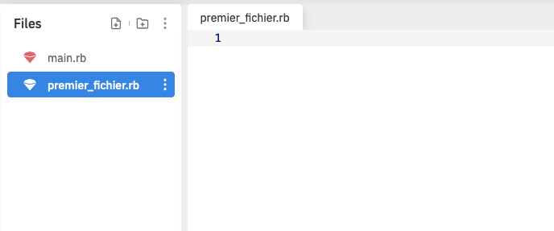
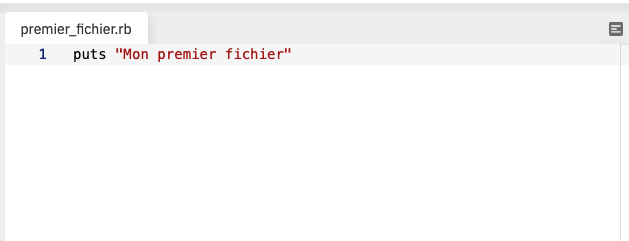
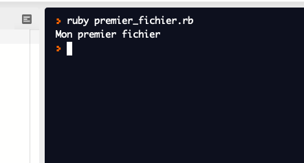
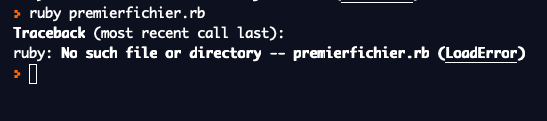

# Session 1 - Présentation de l'EDI REPL.IT

## Démarrage de REPL.it

Pour démarrer notre cours, nous utiliserons un EDI très simple : REPL.IT.

Le nom REPL vient de l'acronyme "Read-Eval-Print Loop" (BLEA en français pour Boucle de Lecture, Evaluation et Affichage).
Un dispositif REPL permet de modifier et d'exécuter facilement du code en continu, et est très utilisé pour faire des tests en développement.

Nous allons maintenant créer notre première instance REPL pour le langage Ruby. Pour cela, merci de cliquer sur le lien suivant : https://repl.it/languages/ruby

## Interface de REPL.it

L'interface REPL se sépare en 3 grandes parties :
- l'espace "Editeur de texte", qui permet de modifier le code d'un programme ;
- l'espace "Navigateur de fichiers", qui permet de gérer nos fichiers de code ;
- l'espace "Console", qui permet d'exécuter le code et d'en voir les résultats.

## Premiers pas avec REPL.it

Pour valider que vous arrivez bien à prendre en main l'interface REPL, nous allons faire un petit exercice :

1) Dans le "Navigateur de fichiers", cliquez sur l'icône "Add file"

2) Saisissez ensuite `premier_fichier.rb` et validez avec la touche "Entrée" de votre clavier. Vous devez obtenir l'écran ci-dessous :

3) Dans l'espace "Editeur de texte", saisissez `puts "Mon premier fichier"`, puis cliquez sur le bouton "Save" situé en haut de l'écran. Vous devez obtenir l'écran ci-dessous :

4) Dans l'espace "Console", saisissez `ruby premier_fichier.rb`et validez avec la touche "Entrée de votre clavier. Vous devez obtenir l'écran ci-dessous :

**ATTENTION :** vous devez impérativement réussir ces étapes avant de continuer le cours. En cas de problème, un message d'erreur doit apparaître en anglais et contient des éléments susceptibles de vous aider à comprendre d'où vient la différence de comportement.

Exemple : un message d'erreur du type "ruby: No such file or directory -- premierfichier.rb (LoadError)" indique que le fichier "premierfichier.rb" n'existe pas (No such file or directory). Cela est normal, car le fichier créé à l'étape 2 s'appelle "premier_fichier.rb", et non pas "premierfichier.rb" (notez le "_" présent dans un nom et pas dans l'autre).

## Partager un fichier REPL.it

Lorsque vous cliquez sur le bouton "Save", REPL.it sauvegarde vos travaux et leur associe un lien unique. Vous pouvez ensuite copier ce lien et l'envoyer à une autre personne.

Par exemple, le lien suivant donne le résultat des étapes réalisées ci-dessus : [https://repl.it/repls/LegalSphericalDistributionsoftware#premier_fichier.rb](https://repl.it/repls/LegalSphericalDistributionsoftware#premier_fichier.rb)

En conséquence, si vous rencontrez un problème durant certains exercices, nous pourrons travailler ensemble sur votre code pour débloquer la situation. Il suffira de partager le lien REPL.it.

Dans la suite du cours, nous allons créer un compte REPL.it.

[Retour à la table des matières](../../../)